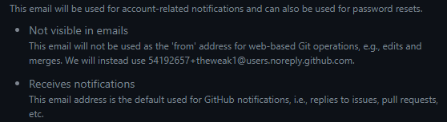
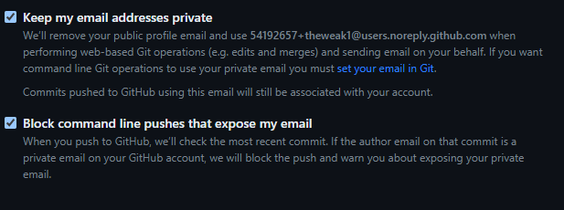

[](https://github.com/theweak1/dotfiles/blob/main/LICENSE)
[](https://github.com/theweak1/dotfiles/issues)
[](https://github.com/theweak1/dotfiles/pulls)
[](https://github.com/theweak1/dotfiles/graphs/contributors)
[](https://github.com/theweak1/dotfiles/issues)

# dotfiles
Dotfiles are configuration files used to customize and personalize your Unix-based system. This repository contains my dotfiles for WSL and Ubuntu.

I'm learning about dotfiles at [dotfiles.eieio.xyz](http://dotfiles.eieio.xyz).

## Dependencies
- Ensure you have the required software installed, such as Git, etc.
- Some configurations may be specific to certain terminals or shells. Ensure you have the necessary tools installed.

## Dotbot Integration

This repository uses [Dotbot](https://github.com/anishathalye/dotbot) for installation and bootstrapping. Dotbot makes it easy to manage and set up dotfiles across multiple machines.

### Setup using Dotbot

1. Clone this repository to your local machine.
2. Navigate to the repository directory.
3. Run the installation script: `./install`

This will create the necessary symbolic links and set up your environment using Dotbot.

### Credits

Dotbot was created by [Anish Athalye](https://github.com/anishathalye). Special thanks to him for developing such a useful tool for the dotfiles community.

## TODO
- Terminal Preferences
- Git (config and SSH)

## Tmux
To finish the Tmux setup, run the following command in a Tmux session:
```bash
tmux source ~/.config/tmux/tmux.conf
```

## gitconfig
If you fork this project, update the `gitconfig` file with your own user information. Specifically, update the `name` and `email` fields. You can find your own non-reply email on GitHub under `setting -> Emails`. Below your primary email, you'll see this message:



Additionally, while in the `Emails` section of your settings, ensure you have these options marked:



